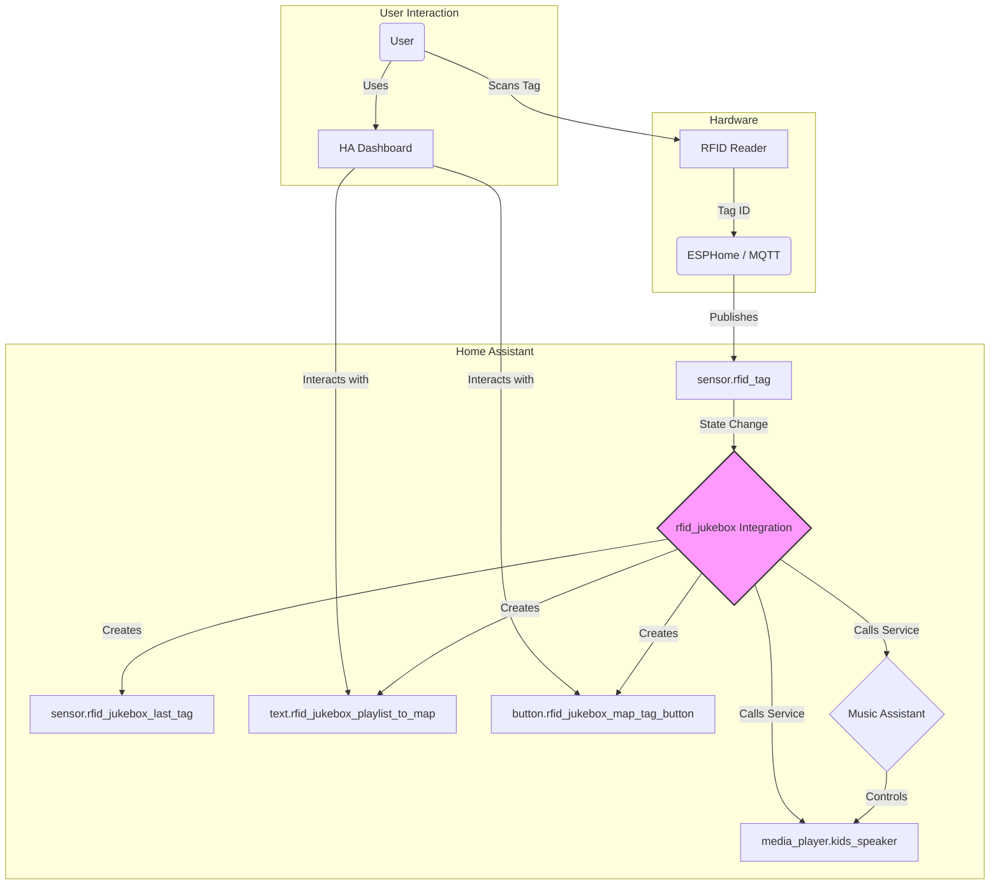
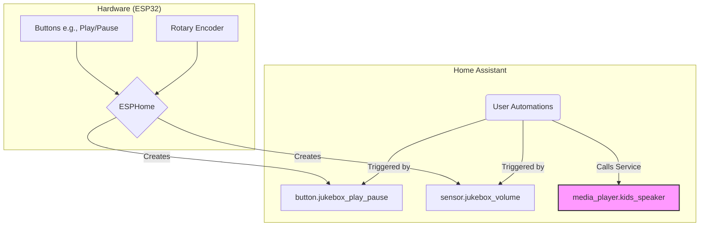

# 🎵 RFID Jukebox: A Home Assistant Music Assistant Controller

Disclaimer: Vibe coded. 

This custom integration for Home Assistant turns any RFID reader into a seamless music jukebox powered by Music Assistant. The goal is to create a simple, robust, and kid-friendly way to play music using physical RFID tags.

This project is inspired by the desire for a less complex alternative to solutions like Phoniebox, leveraging the power and flexibility of Home Assistant, ESPHome or squeezelite-esp32, and Music Assistant. 

The intended hardware, at the moment of writing, is a loud-esp32 by sonocotta. This section will be expanded as the project advances. 

## 🎯 Core Features

*   **Tag-Based Playback**: Scan an RFID tag to instantly play the linked Music Assistant playlist.
*   **Seamless Control**: Play, pause, or resume music directly from tag presence.
*   **Simple Mapping UI**: A user-friendly interface within Home Assistant to map new RFID tags to playlists.
*   **Unknown Tag Alerts**: Get notified via TTS when an unmapped tag is scanned.
*   **Standalone & Integrated**: Works with any RFID reader that can publish tag IDs to an HA entity (e.g., via ESPHome or MQTT).

## 🏗️ System Architecture

The integration ties together three main components: the RFID reader, Home Assistant, and Music Assistant.



1.  An **RFID Reader** (or a test `input_text` helper) provides a tag ID to the `tag_sensor` entity.
2.  The **`rfid_jukebox`** integration listens for state changes on this sensor.
3.  **If a new tag is presented**, the integration calls the `music_assistant.play_media` service to start the mapped playlist from the beginning.
4.  **If the tag is removed** (the sensor state becomes `none` or empty), the integration calls `media_player.media_pause` to pause playback.
5.  **If the same tag is presented again**, the integration calls `media_player.media_play` to seamlessly resume playback from where it left off.

### Physical Controls (Buttons & Knobs)

This integration is designed to work seamlessly with physical controls like buttons and rotary encoders for a true jukebox feel. The recommended approach is to decouple the hardware from the playback logic using standard Home Assistant patterns.



1.  **Hardware**: Connect buttons and a rotary encoder to your ESP32 device.
2.  **ESPHome**: Configure ESPHome to create `button` and `sensor` entities in Home Assistant for each physical control.
3.  **Automations**: Create standard Home Assistant automations that are triggered by these new entities. For example:
    *   When `button.jukebox_play_pause` is pressed, call the `media_player.media_play_pause` service on the target speaker.
    *   When `sensor.jukebox_volume` changes, call the `media_player.volume_set` service.

This keeps the `rfid_jukebox` integration focused on its primary role while giving you the full power of Home Assistant to customize physical controls.

### Testing with an Input Text Helper

You can test the entire functionality of this integration without a physical RFID reader.

1.  Create an `input_text` helper in Home Assistant (e.g., `input_text.rfid_test_tag`).
2.  In your `configuration.yaml`, set the `tag_sensor` to this helper's entity ID:
    ```yaml
    rfid_jukebox:
      tag_sensor: input_text.rfid_test_tag
      # ... your other settings
    ```
3.  Add the `input_text` helper to your dashboard.
    *   **To simulate a tag scan**, type any text into the box and press Enter.
    *   **To simulate removing the tag**, you can either **clear the text box** so it's empty, or type the word `none` or `unknown`.

## ⚙️ Configuration

To use this integration, add the following to your `configuration.yaml` file:

```yaml
# configuration.yaml
rfid_jukebox:
  tag_sensor: sensor.rfid_tag_id
  media_player: media_player.kids_room_speaker
  mapping_file_path: "/config/rfid_mappings.yaml"
  unmapped_tag_tts_message: "This tag is not yet mapped to a playlist." # Optional
  tts_service: "tts.google_say" # Optional: The TTS service for announcements
```

**Note:** You do not need to create the `rfid_mappings.yaml` file yourself. The integration will automatically create it the first time you map a tag.

## 🎛️ Entities

This integration automatically creates the following entities to provide a simple UI for mapping tags:

-   **`sensor.rfid_jukebox_last_tag`**: Displays the ID of the last scanned RFID tag.
-   **`text.rfid_jukebox_playlist_to_map`**: A text field where you will type the exact name of the Music Assistant playlist you want to map.
-   **`button.rfid_jukebox_map_tag_button`**: A button that, when pressed, maps the last scanned tag to the playlist name you entered in the text field.

## 🏷️ How to Map a New Tag

Mapping a new tag is a simple, three-step process:

1.  **Scan the new RFID tag.** The `sensor.rfid_jukebox_last_tag` entity will update to show its ID.
2.  **Type the exact name** of the desired Music Assistant playlist into the `text.rfid_jukebox_playlist_to_map` field on your dashboard.
3.  **Press the `Map Scanned Tag` button.** The integration will save the mapping, and the tag is ready to use.

## 🔧 Services

The integration provides services for advanced control and automation:

-   **`rfid_jukebox.map_tag`**: (Advanced) Allows mapping a tag via an automation or script. Accepts `tag_id` and `playlist_name`. The UI button calls this service internally.
-   **`rfid_jukebox.reload_mappings`**: Manually reloads the tag-to-playlist mappings from the YAML file without restarting Home Assistant.

## 🗺️ Project Roadmap

This project will be developed in phases.

### Phase 1: Core Functionality (MVP)

This is the initial version described in the implementation plan above, focusing on delivering a working jukebox with YAML-based configuration.

-   [x] **Integration Skeleton**: Create all necessary files (`__init__.py`, `manifest.json`, etc.).
-   [x] **YAML Configuration**: Load settings from `configuration.yaml`.
-   [x] **Tag Listener**: Track the state of the specified RFID sensor.
-   [x] **Playback Control**: Play/pause/resume Music Assistant playlists.
-   [x] **Mapping Persistence**: Load/save mappings to a YAML file.
-   [x] **Integrated Mapping UI**: Automatically create all entities required for mapping.

### Phase 2: User Experience & Visibility

Once the core is stable, we will focus on making the integration easier to configure and monitor.

-   [ ] **Config Flow**: Implement a full GUI-based configuration flow in `config_flow.py`. This will guide users through setup and remove the need for manual YAML editing.
-   [ ] **Options Flow**: Allow reconfiguration (e.g., changing the media player) without deleting and re-adding the integration.
-   [ ] **Status Sensor**: Create a `sensor.rfid_jukebox_status` entity with detailed attributes (`current_playlist`, `last_scanned_tag`, `state`). This will enable rich dashboard widgets and automations. Please note this might be redundant, as home assistant has the media player gui. 

### Phase 3: Advanced Playback Controls

This phase will introduce more interactive and powerful ways to control the music.

-   [ ] **Control Tags**: Introduce the concept of special tags for actions like:
    -   Volume Up / Down
    -   Next / Previous Track
    -   Toggle Shuffle / Repeat
-   [ ] **Expanded Services**: Add new services to `services.yaml` (e.g., `rfid_jukebox.set_volume`, `rfid_jukebox.next_track`) that can be used in automations or with control tags.

### Phase 4: All-in-One Hardware Integration

This phase will address the goal of a more "batteries-included" experience by building the hardware control logic directly into the integration, making it an optional feature for users who want a simpler setup.

-   [ ] **Direct Button/Sensor Configuration**: Update the Config Flow to allow users to optionally select entities for Play/Pause, Next/Previous, and Volume control.
-   [ ] **Internal Event Listeners**: The integration will listen to state changes from the configured button and sensor entities directly.
-   [ ] **Internal Service Calls**: Instead of relying on user-created automations, the integration itself will call the appropriate `media_player` services in response to hardware events.