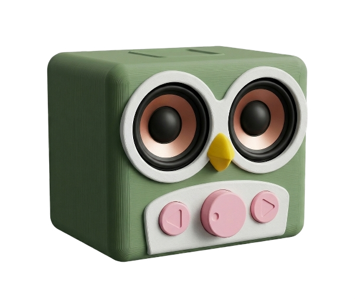

# 🎵 Owlbox: A DIY RFID Jukebox

<p align="center">
  
</p>

The Owlbox is a simple, kid-proof jukebox powered by an ESP32, a PN532 RFID reader, and a pair of speakers. This project uses **ESPHome** for the device firmware, **Music Assistant** for playback, and **Home Assistant** for orchestration and a user-friendly interface.

---

## ✨ Features

-   **Tap-to-Play:** Present an RFID tag to start playing a Music Assistant folder or playlist.
-   **Auto-Pause:** Remove the tag, and the music pauses.
-   **Smart Resume:** Present the same tag to resume, or a new tag to play new media.
-   **Tactile Controls:** A rotary encoder controls volume, and buttons handle previous/next track.
-   **Parental Mute:** A Home Assistant mute button ensures quiet time.
-   **Fully Scriptable:** Controllable from Home Assistant for endless automation possibilities.
-   **Wi-Fi Speaker:** Can also be used as a standard Wi-Fi speaker.

---

## 🧱 Hardware & Assembly

For detailed hardware, assembly, and 3D printing instructions, please see the **[Hardware Manual](docs/manual.md)**.

The core components are:
-   [Louder-ESP32S3](https://sonocotta.com/louder-esp32/)
-   PN532 RFID reader (SPI recommended)
-   Rotary encoder (e.g., Keyestudio 040)
-   2× momentary buttons
-   Passive speakers + 5V/3A power supply
-   [3D-printed enclosure](https://makerworld.com/en/models/1914879)

---

## 🚀 Software Setup Guide

### Prerequisites

This integration requires [HACS (Home Assistant Community Store)](https://hacs.xyz/docs/setup/download) to be installed in your Home Assistant instance.

### Step 1: Flash the ESPHome Firmware

1.  Use the provided `esphome/jukebox.yaml` file.
2.  Adjust the pin configuration in the YAML to match your wiring.
3.  Compile and flash the firmware to your ESP32 using ESPHome.

### Step 2: Install the RFID Jukebox Integration

1.  **Add the Custom Repository in HACS:**
    *   In Home Assistant, go to **HACS > Integrations**.
    *   Click the three-dot menu and select **Custom repositories**.
    *   **Repository:** `https://github.com/XtracT/rfid_jukebox`
    *   **Category:** `Integration`
    *   Click **Add**.
2.  **Install the Integration:**
    *   Find the **RFID Jukebox** integration in HACS and click **Install**.
3.  **Restart Home Assistant** to load the integration.

### Step 3: Configure the Integration

1.  Go to **Settings > Devices & Services**.
2.  Click **Add Integration** and search for **RFID Jukebox**.
3.  In the configuration window, select the following entities:
    *   **RFID Tag Sensor**: The sensor created by ESPHome that reports the RFID tag UID (e.g., `text_sensor.rfid_jukebox_tag`).
    *   **Music Assistant Player**: The media player entity for your jukebox (e.g., `media_player.jukebox_*`).
    *   **Music Assistant Filesystem ID**: The ID for your Music Assistant music source (e.g., `filesystem_local--tkx9ahNv`).
        *   **Tip**: To find this, set up a "local disk" music provider in Music Assistant. Then, go to **Browse > Filesystem** in the Music Assistant UI. The ID will be at the top of the page or in the URL.

### Step 4: Map RFID Tags to Media

1.  Scan an RFID tag. The `sensor.rfid_jukebox_last_tag` entity in Home Assistant will update with the tag's UID.
2.  In the integration's configuration UI, select the media type (`playlist` or `folder`).
3.  Enter the name of the media (e.g., "Kids Party Time" or "audiobooks/stories_for_kids").
4.  Optionally, enter a friendly alias for the tag (e.g., "Snoopy").
5.  Press the **Map Tag** button to save the mapping.

---

## ⚙️ Advanced Details

### How It Works

1.  **ESPHome** detects an RFID tag and publishes its UID to a `text_sensor` in Home Assistant.
2.  The **RFID Jukebox integration** maintains a mapping of tag UIDs to media files or playlists.
3.  When a known tag is detected, the integration calls the appropriate **Music Assistant** service to start playback on the jukebox.

### Mute Functionality

The firmware includes a software-based mute feature, perfect for controlling playback times. When muted, the volume is set to 0%, and the rotary encoder is disabled. This can be controlled via a Home Assistant automation (e.g., mute from 8 PM to 8 AM).

### Mapping File

Tag mappings are stored in `rfid_mappings.yaml` in your Home Assistant configuration directory. You can edit this file manually for advanced configuration.

```yaml
"01:23:45:67:89:AB":
  alias: "Kids' Party Mix"
  type: "playlist"
  name: "Kids Party Time"
"CD:EF:01:23:45:67":
  alias: "Bedtime Stories"
  type: "folder"
  name: "audiobooks/stories_for_kids"
```

---

## 🗺️ Roadmap

-   Improve reliability and startup behavior.
-   Test with **snapclient**.

---

## 🤝 Contributing

PRs and issues are welcome! Feel free to add support for other boards, improve documentation, or enhance playback reliability.

---

## 🙏 Acknowledgements

-   [Phoniebox](https://phoniebox.de/index-en.html)
-   [ESPHome](https://esphome.io/)
-   [Music Assistant](https://music-assistant.io/)
-   Sonocotta’s Louder-ESP32S3 & TAS5805M component
