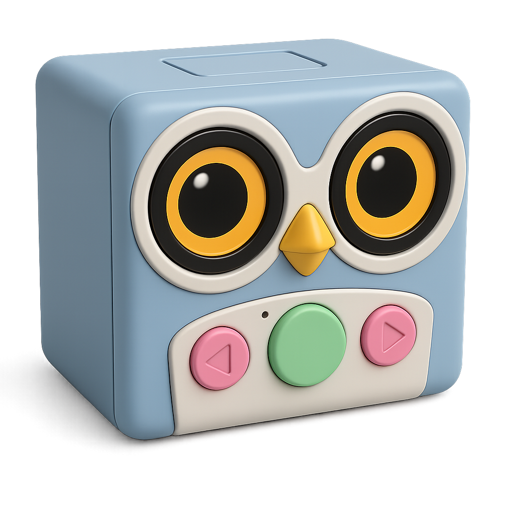

# 🎵 RFID Jukebox / Phoniebox — Based on Home Assistant, ESPHome and Music Assistant 

<p align="center">
  
</p>

A simple, kid-proof jukebox you can build with an ESP32 based DAC amplifier, a PN532 RFID reader, and a pair of speakers. 
This build focuses on **ESPHome** for device firmware, **Music Assistant** for playback, and **Home Assistant** for orchestration/UI.

---

## ✨ Highlights

- **Present a tag → music starts** (Music Assistant folder or playlist)
- **Remove tag → music pauses**
- **Present the same tag → music resumes**, **new tag → start playing new mediar**
- **Rotary encoder** for volume, **buttons** for prev/next
- Two approaches (HA-centric vs esp32-centric)

---

## 🧱 Hardware (tested)

- [Louder-ESP32S3](https://sonocotta.com/louder-esp32/) (from Sonocotta, highly recommended!)
- PN532 RFID reader (**SPI** tested; **I²C** likely fine but **not tested** here)  
- Rotary encoder (e.g., Keyestudio 040)  
- 2× momentary buttons  
- Passive speakers + 5V/3A power (enough for a kid!)
- Optional 3D-printed enclosure (files/link coming soon)

> Pinouts in the sample YAMLs target Louder-ESP32S3 + PN532 (SPI). Adjust as needed.  
> I²C hasn’t been tested here to avoid interfering with the DAC interface.

---

## 🚀 Quick Start 

### 1) Flash the basic ESPHome firmware
- Use `esphome/jukebox.yaml`.
- Adjust pins to your wiring.
- Compile & flash with ESPHome.

### 2) Install the integration via HACS
- In Home Assistant: **HACS → Integrations → Search “RFID Jukebox” → Install**.  
  If it’s not listed yet, add this repo as a **Custom Repository** (category: *Integration*), then install via HACS.
- **Restart Home Assistant**.

### 3) Add the integration
- Go to **Settings → Devices & Services → Add Integration → RFID Jukebox**.
- Select:
  - The **RFID tag sensor** (from ESPHome, e.g. `text_sensor.rfid_jukebox_tag`)
  - Your **Music Assistant player** entity (e.g. `media_player.jukebox_*`)
  - Your **Music Assistant Filesystem ID** (e.g. `filesystem_local--tkx9ahNv`). This is required for playing folders.
  - Tip: you can discover `<filesystem_id>` in Music Assistant (UI/logs), e.g. `filesystem_local--tkx9ahNv`.


### 4) Map tags from the HA UI
- Scan a tag → `sensor.rfid_jukebox_last_tag` updates.
- Select the media type (`playlist` or `folder`).
- Enter the media name (e.g., "Kids Party Time" or "audiobooks/stories_for_kids").
- Optionally, enter an alias for the tag (e.g Snoopy).
- Press `button.rfid_jukebox_map_tag_button`. Done!


---

## 🅰️ Option 1 — HA-centric (Custom Integration) ✅

**Folder:** `homeassistant/custom_components/rfid_jukebox`  
**Firmware:** `esphome/jukebox.yaml` (basic: tag + buttons/encoder)

What it does:
- ESPHome publishes the tag to HA (`text_sensor`) and can emit HA events.
- The integration maintains the **tag → folder** mapping and calls Music Assistant.

**Integration UI entities:**
- `sensor.rfid_jukebox_last_tag` — last scanned UID
- `select.rfid_jukebox_media_type` — choose between `playlist` and `folder`
- `text.rfid_jukebox_media_name_to_map` — enter the name of the media
- `text.rfid_jukebox_alias` — optionally, provide a friendly name for the tag
- `button.rfid_jukebox_map_tag_button` — save the mapping

**Why this path:**
- Clean separation of concerns
- Easy to edit/backup/share mappings (HA backups, versioning)
- Scales to multiple readers/rooms

**Mapping File (`rfid_mappings.yaml`):**

The integration supports a mapping format that includes aliases and media types.

```yaml
"01:23:45:67:89:AB":
  alias: "Kids' Party Mix"
  type: "playlist"
  name: "Kids Party Time"
"CD:EF:01:23:45:67":
  alias: "Bedtime Stories"
  type: "folder"
  name: "audiobooks/stories_for_kids"
```
---

## 🅱️ Option 2 — ESPHome-centric “AIO” (Just for testing, advanced)

**File:** `esphome/jukebox-aio.yaml`

What it adds (on top of the basic YAML):
- **On-device mapping in NVS:** each tag (normalized UID) stores a folder string (`char[64]` by default; bump to 128 if you use long names).
- **Direct Music Assistant call** from ESPHome (builds `<fs>://folder/<name>`).
- **Resume vs start:** same tag → `media_player.play`, different tag → play new folder.
- **ESPHome UI:** `text.rfid_folder_to_map` + `button.map_current_tag → folder`.

**Getting started:**
1. Set `ma_filesystem`, `ma_entity`, and pins under `substitutions`.
2. Compile & flash with ESPHome.  
   *Note:* `ma_entity` is your MA player entity in HA. If you don’t know it yet, flash once to bring up the player, then update `ma_entity` and re-flash.
3. In the device page, set **RFID Folder to Map**, scan a tag, press **Map Current Tag → Folder**.
4. Scan mapped tags to play.

**When to use this:**
- You want device-level mapping and the smallest perceived latency.
- You’re fine managing mappings per device instead of centrally in HA.
- You are bored. 

---

## 🗺️ Roadmap

- Improve reliability and startup behavior
- Test with **snapclient** 

---

## 🤝 Contributing

PRs and issues welcome! Add support for other boards/readers, improve playback, docs, or reliability.

---

## 🙏 Acknowledgements

- [Phoniebox](https://phoniebox.de/index-en.html)
- [ESPHome](https://esphome.io/)
- [Music Assistant](https://music-assistant.io/)
- Sonocotta’s Louder-ESP32S3 & TAS5805M component
- Everyone building kid-friendly players and sharing their tricks 💿🧸
