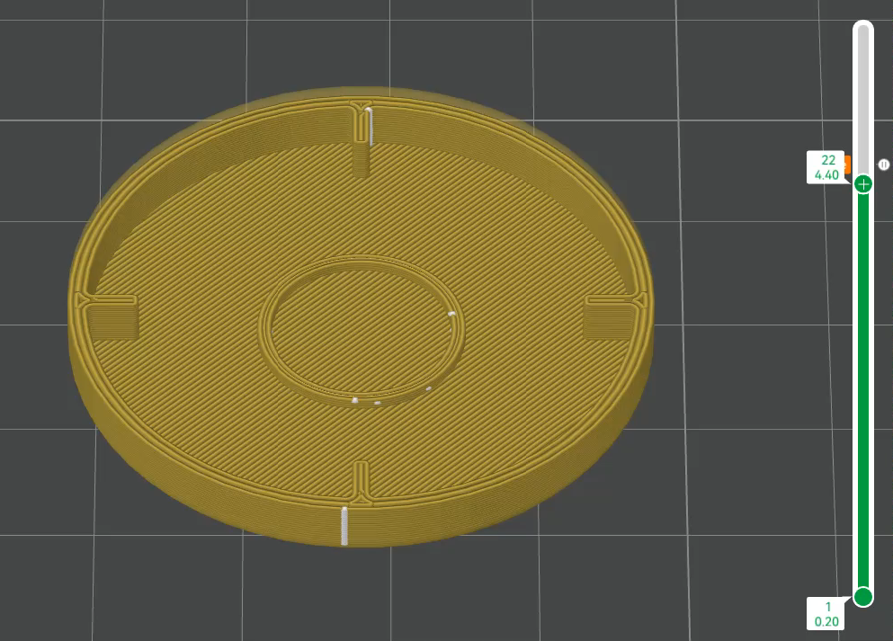
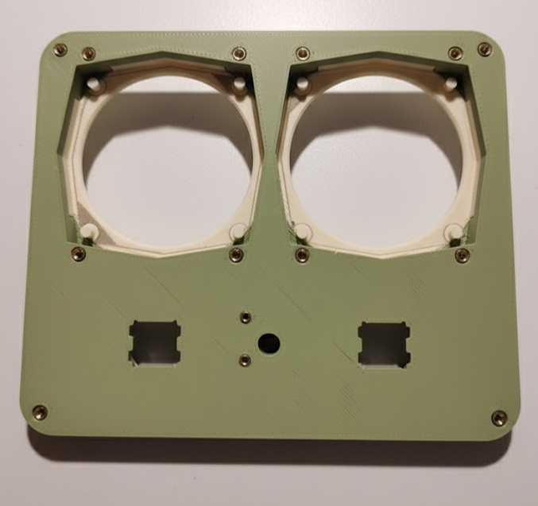
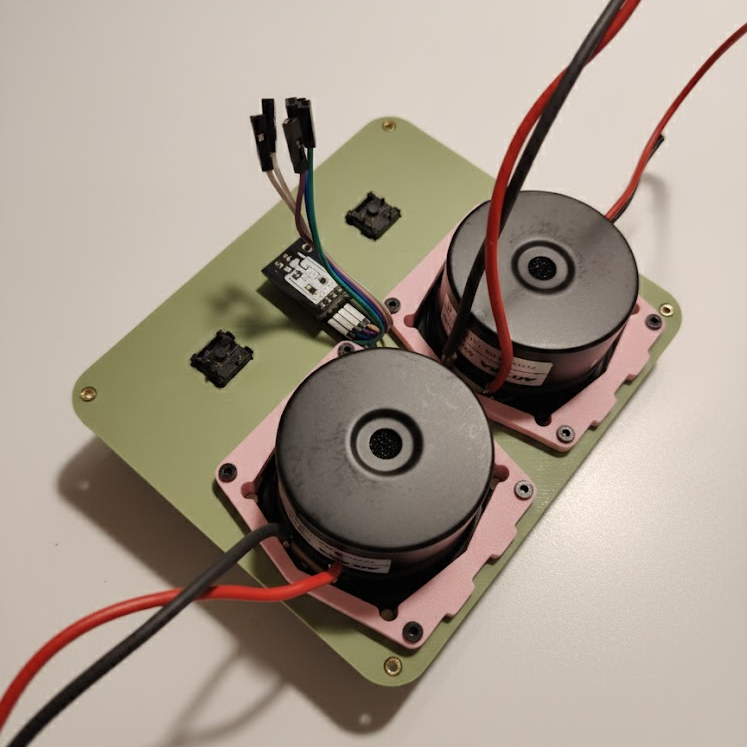
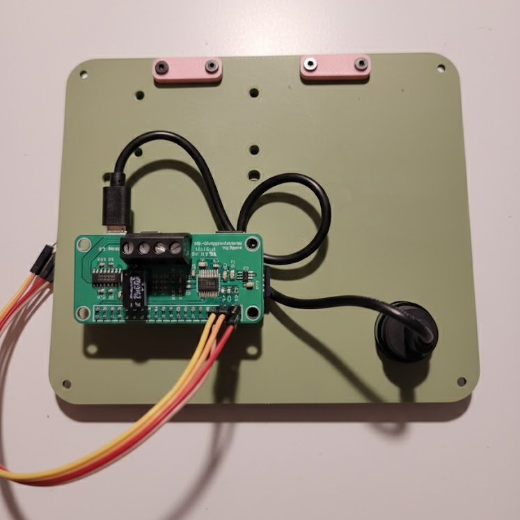
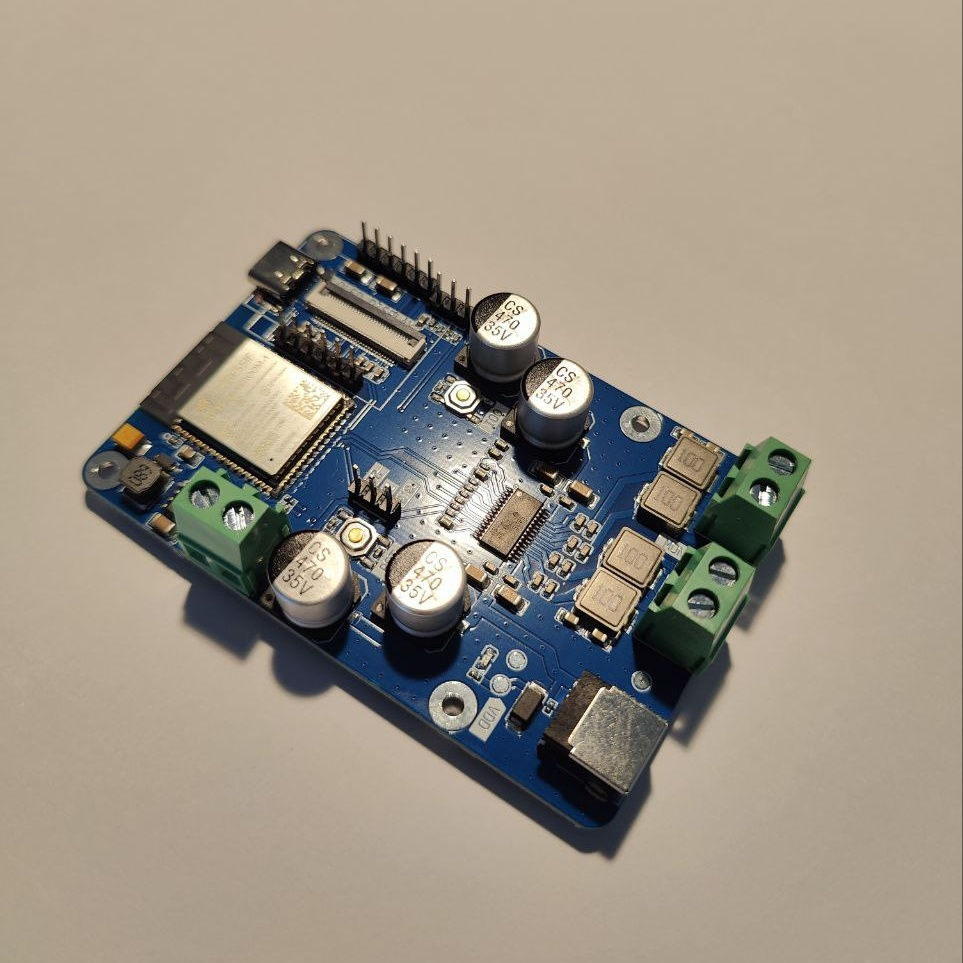
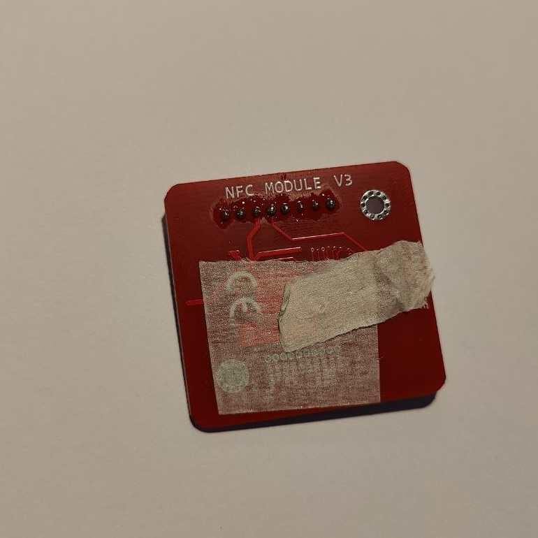
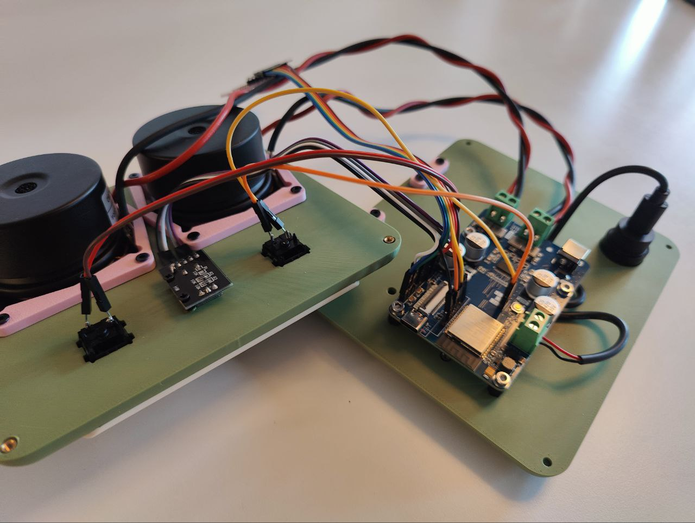
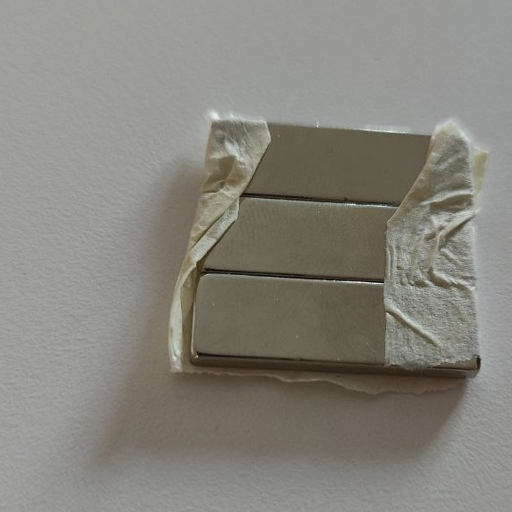

# **Owlbox: A DIY RFID Jukebox Guide**

## **1. Project Overview**

Welcome to the Owlbox! This is an adorable, 3D-printed speaker designed to be controlled by physical RFID tags. It's a fantastic project for introducing kids to music, stories, and technology in a simple, screen-free, and interactive way.

This enclosure is designed for robustness (toddler-tested!) and flexibility. It can be built using two main platforms:

*   **ESP32 Build:** A cost-effective build using the **Sonocotta LOUDER ESP32** board, integrated with Home Assistant and Music Assistant.
*   **Raspberry Pi Build:** A powerful build using a **Raspberry Pi (Zero, 4, or 5)**, perfect for running the popular **Phoniebox** project.

**Key Features:**

*   **Clean, Screw-Free Front:** The entire assembly is held together from the back.
*   **Internally Braced:** Internal braces prevent the body from flexing or bending.
*   **Tactile Controls:** Uses satisfying mechanical (MX) switches and a rotary encoder.
*   **Magnetic Tag System:** Printable RFID tag bases with embedded magnets snap onto a hidden magnet in the enclosure.

---

## **2. Bill of Materials**

This project requires a mix of 3D printed parts and readily available electronics.

### **2.1 3D Printed Parts**

It is highly recommended to use the print profiles provided in the Makerworld project repository. These profiles are pre-configured with optimal settings and support placements.

### **2.2 Electronics & Hardware**

#### **Core Platform (Choose ONE)**

**Option A: ESP32 Build (Recommended for Home Assistant users)**

*   **Microcontroller:** 1x [Sonocotta LOUDER ESP32](https://sonocotta.com/louder/)
*   **Software:** [RFID Jukebox GitHub Project](https://github.com/XtracT/rfid_jukebox)
*   **Internal Power Cable:** 1x USB-C to bare wire pigtail (to connect the panel mount to the LOUDER VIN).

**Option B: Raspberry Pi Build**

*   **Microcontroller:** 1x Raspberry Pi (Zero, 4, or 5)
*   **Software:** [Phoniebox Project](https://phoniebox.de/)
*   **Audio:** 1x DAC/Amplifier HAT for the Pi (e.g., HiFiBerry MiniAmp). Ensure it can drive two 4 Ohm speakers at 5V.
*   **Internal Power Cable:** 1x USB-C to Micro-USB (for Pi Zero) or USB-C to USB-C (for Pi 4/5).

#### **Common Electronics (Required for BOTH builds)**

*   **Speakers:** 2x **2.5-inch Full-Range Speaker Drivers**.
    *   *Note: This enclosure is designed for **AIYIMA 2.5-inch drivers** (68x68mm frame). The **4 Ohm** version is highly recommended for a 5V-6V power supply.*
*   **RFID Reader:** 1x **PN532** Module (SPI interface recommended).
*   **Rotary Encoder:** 1x **KY-040** Module.
*   **Buttons:** 2x **MX-style Mechanical Keyboard Switches** (e.g., Cherry, Gateron).
*   **Panel Connector:** 1x **USB-C Panel Mount**.
*   **Power Source:** 1x **5V-6V DC Power Adapter (min. 3A)**. A standard 5V 3A USB-C adapter is a great starting point.
*   **RFID Tags:** **30mm Round RFID Tags** (13.56MHz, e.g., NTAG213/215).
*   **Magnets:**
    *   **For Tag Base:** 5+ **12mm x 3mm Coin Magnets**.
    *   **For Enclosure:** Any strong magnet (e.g., rectangular). This will be glued inside the enclosure.
*   **Wiring:**
    *   **Speaker Wire:** ~1m of **0.5mm² (approx. 20-21 AWG)** wire.
    *   **Signal Wire:** Assorted **DuPont-style jumper wires** (Female-to-Female, Female-to-Male).

#### **Fasteners & Tools**

*   **Brass Inserts:**
    *   22x **M3x4mm** (Heat-set)
    *   2x **M2.5x3mm** (Heat-set)
*   **Screws:**
    *   4x **M3 x 100mm** (Socket-head)
    *   12x **M3 x 8mm** (Socket-head)
    *   4x **M3 x 6mm** (Socket-head)
    *   2x **M3 x 6mm (Countersunk)**
    *   2x **M2.5 x 3mm**
*   **Required Tools:**
    *   Soldering Iron & Solder
    *   **Brass Insert Press Tip** for soldering iron
    *   Hex Keys (M3 and M2.5)
    *   Wire Stripper & Cutters
    *   Super glue or hot glue

---

## **3. Software & Firmware Setup**

Before starting the physical assembly, it is crucial to flash your microcontroller and test the core electronics.

*   **For the ESP32 Build:** Follow the setup guide on the [rfid_jukebox GitHub repository](https://github.com/XtracT/rfid_jukebox).
*   **For the Raspberry Pi Build:** Follow the official Phoniebox documentation to install the software on your Pi.

---

## **4. 3D Printing Guide**

### **Printing the Faceplate**

This is the only part that requires supports. For best results, use PETG as the support interface material, as configured in the provided print profile.

### **Printing the RFID Tag Base**

This part is designed to permanently embed the RFID tag and magnet.

1.  Slice the RFID Tag Base model.
2.  In your slicer, add a **Pause command** at the layer just before the cavities for the tag and magnet are sealed.

    

3.  Start the print. When it pauses, carefully place one **30mm RFID tag** and one **12x3mm magnet** into their slots.
4.  Resume the print to seal the components inside.

---

## **5. Hardware Assembly**

### **Step 1: Preparation & Component Assembly**

1.  **Install Brass Inserts:** Carefully use your soldering iron and a press tip to melt all brass inserts into their corresponding holes on the **Faceplate** and **Back Panel**.

    

2.  **Solder Pin Headers:** For easier assembly, solder pin headers to the Louder ESP32, PN532, MX switches, and rotary encoder. This allows for flexible connections using jumper wires.
3.  **Assemble the Faceplate:**
    *   Mount the **KY-040 encoder** using **2x M2.5x3mm screws**.
    *   Snap the two **MX switches** into their square slots.
    *   Place the two **2.5-inch Speakers** into the recessed "eye" holes.
    *   Secure the speakers with the **Speaker Brackets** using **8x M3x8mm screws**.

    

4.  **Assemble the Back Panel:**
    *   Mount the two **Internal Braces** using **4x M3x8mm screws**.
    *   Mount the **USB-C Panel Mount** using **2x M3x6mm Countersunk screws**.
    *   For Raspberry Pi builds, the mounting will look like this:

    

### **Step 2: Wiring & Connections (ESP32 Build)**

With the components mounted, you can now perform the wiring. It is easier to do this *before* mounting the Louder ESP32 board, as the pin labels are on the back.

1.  **Configure PN532 for SPI:** Set the DIP switches on the PN532 board for SPI communication: `[SWITCH 1: OFF, SWITCH 2: ON]`. It's also a good idea to protect the solder points with electrical tape.

    
2.  **Connect Components to Louder ESP32:** Refer to the `esphome/jukebox.yaml` file for the exact pinout.
    *   **PN532 RFID Reader:** Connect `Vcc` to `3.3V`, `GND` to `G`, and the SPI pins (MOSI, MISO, SCK, CS) to the W5500 header.
    *   **Rotary Encoder:** Connect `+` to `3.3V` and `GND` to `G`.
    *   **Buttons:** Connect the MX switches to the 3-pin JST sockets.
    *   **Speakers:** Connect the speaker wires to the speaker terminals.

### **Step 3: Final Assembly**

1.  **Mount the Louder ESP32:** Secure the board to the **Back Panel** using **4x M3x6mm screws**.
2.  **Connect Power:** Connect the USB-C pigtail from the panel mount to the screw terminals on the Louder ESP32.
3.  **Position the Enclosure:** Slide the main enclosure body over the back of the **Faceplate**. The cables should be long enough to allow both the faceplate and back panel to sit on either side.
4.  **Mount the PN532 & Magnets:**
    *   Secure the **PN532 RFID Reader** to the posts inside the main enclosure. The asymmetrical design ensures it can only be mounted one way.
    *   **Position the Magnets:** This can be tricky. Place three 27x9x2.5mm magnets next to each other. To combine their strength, ensure their magnetic fields point in the same direction. Use tape to hold them in place while you glue them.
    *   **Untested Alternative:** A single, strong 30mm diameter x 3mm high N52 magnet may work and would be easier to install.

    
    
    

5.  **Secure the Enclosure:** Align the **Back Panel** with the back of the main enclosure. Insert the **4x M3x100mm screws** from the back and tighten evenly until snug. **Do not overtighten!**

---

## **6. Operation**

1.  **Power On:** Connect your USB-C power source.
2.  **Play Media:** Place an RFID Tag Base—with a figurine glued on top—onto the Owlbox. The magnet will hold it in place.

    

3.  **Controls:**
    *   **Knob:** Turn to adjust volume. Press to play/pause.
    *   **Buttons:** Previous/Next track.

Enjoy your new Owlbox!
